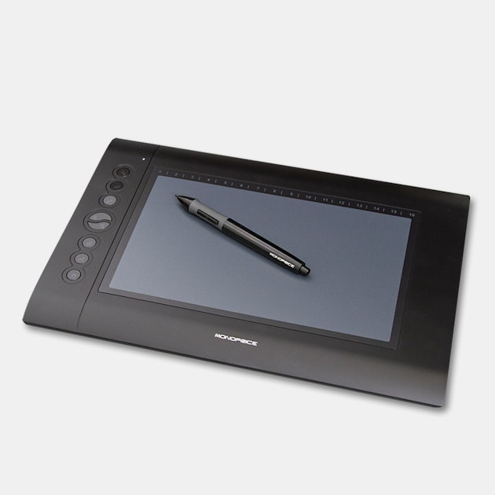

# Grafic tablet GnuLinux

### A easy way(grafic script) for manage the configurations of your grafic tablet over Gnu+Linux😉😎



---- 

#### Let's explain how works this thing hommies:

* First you must to install the kernel support for grafic tablets, ok let's go more slowly, mostly GnuLinux distros already have include the support by default, but if you have any problem with your grafic tablet or its model is very new, you should try to install the most newest kernel drivers of support( :warning: this is by your own choose, if you don't know so much about this keep care about this, by default this not should create a fail if you follow the instructions sucefully) in [digimend](https://digimend.github.io/tablets/) github site you can get more info about the tablets models supported and from [digimend github repo](https://github.com/DIGImend/digimend-kernel-drivers).

> 

* When you already have your kernel drivers update just clone this github repo in your pc (paste the below command in your terminal and run it):

```bash
git clone https://github.com/axelanimus/grafictabletlinux
```

* Test if your distro have installed [zenity binary](https://help.gnome.org/users/zenity/stable/)(This binary is very important due it's use for build the window dialogs), paste this command in your terminal: 

```bash
hash zenity: [[ 0 -ne $? ]] && echo -e "\n Zenity binary is not installed\n"
```

* If the zenity binary isn't installed and you're using any distro that not use apt package manager you must install [zenity binary](https://help.gnome.org/users/zenity/stable/) manually with the respective package manager of your distro(Sorry, by now the installer script just works with apt, but in the future it will works with all the package managers)

##### Here we gonna see some ways for run the script correctly depend the case.
---

#### If you use any GnuLinux distro with apt package manager


* This is super easy bro( wnie😁😉😏) first give execution permisions to the `installer.sh` script(paste the below code in your terminal located inside the folder of this repo) and follow the instructions of the installer script:

```bash
sudo chmod u+x installer.sh; ./installer.sh
```

* Then just give execution permisses to the `main.sh` script and run it with this command:

```bash
sudo chmod u+x main.sh; ./main.sh
```
---

#### If your distro don't use apt package manager and but it have installed zenity

* Sorry buddy but you gonna need install another distro, is the only way...Sorry😝😉😁...Ok is joke, this super easy, is just give execution permisses to the main.sh script and then run it, paste this commands in your terminal if you have lazyness of write the command by your own:

```bash
sudo chmod u+x main.sh
```

* Then just run it

```bash
./main.sh
```
---

And this is all cuz, right now is very chafita the script, but with the time I gonna do more upgrades of this litle piece of beatiful trash, by now it should works fine for asociate keys and shortcuts to the buttons of your grafic tables, so **Animus && Never Give Up**.


credit for the icons:
<a href="https://www.flaticon.com/free-icons/ai" title="ai icons">Ai icons created by Freepik - Flaticon</a>
